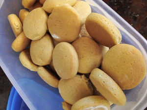

# Galletitas Azucaradas.

- Tiempo de preparación: 30 min
- Tiempo de cocción: 17 min
- Porciones: 500 g aprox

## Ingredientes

- 350 g harina leudante
- 125 g azúcar
- 66 g aceite
- 50 g leche
- 1 cdta esencia de vainilla
- 1 huevo

## Preparación

1. Mezclar el aceite con el azúcar, la esencia de vainilla, y el huevo
2. Por último de manera alternada la harina y la leche hasta formar una masa
3. Estirar, cortar y poner en molde enharinado
4. Llevar a horno precalentado a 180º C hasta que se doren, unos 17 min

